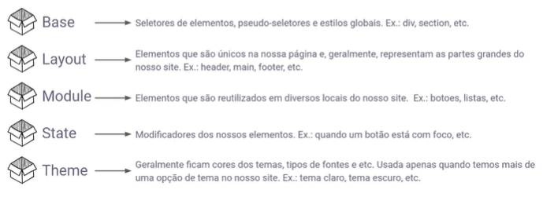

# SMACSS (Scalable and Modular Architecture for CSS)

O SMACSS é uma metodologia para estruturar e organizar código CSS de maneira escalável e modular.


### Organização do Código

Diretórios e Arquivos Claros:

Organize arquivos CSS em diretórios específicos para Base, Layout, Module, State, e Theme.
Nomenclatura Consistente:

Use uma nomenclatura consistente para classes, evitando estilos diretamente em tags HTML.

### Benefícios

Manutenção Simplificada:

Facilita a localização e atualização de estilos, reduzindo a complexidade.
Reutilização de Código:

Componentes modulares podem ser reutilizados em várias partes do projeto.

### Colaboração Eficiente:

Permite que diferentes membros da equipe trabalhem em módulos específicos sem conflitos.

```bash
/* Base */
body {
  margin: 0;
  padding: 0;
}

/* Layout */
.header { /* ... */ }
.footer { /* ... */ }

/* Module */
.button { /* ... */ }
.menu { /* ... */ }

/* State */
.button:hover { /* ... */ }

/* Theme */
.theme-dark .button { /* ... */ }
```
